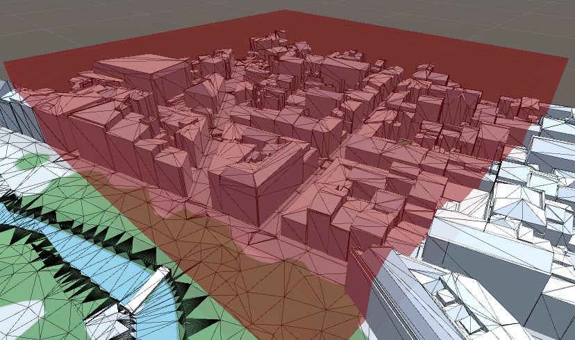
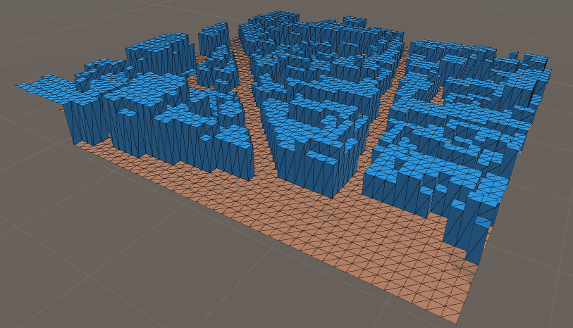
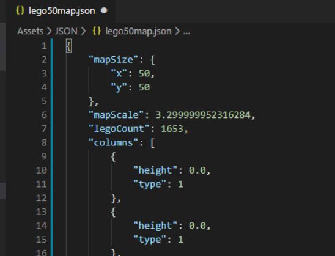

# Lego CITY COUNTER
Gamagora 2019 - Transformation of a Mesh into Lego 
https://github.com/antoinechedin/lego-city-counter 
**Antoine CHEDIN & Rendy LATBI**

## Description

This is a Unity project that enables you to produce a lego model of a building, a neighbourhood or an entire city. Using Unity editor v2019.2.x, and provided you have a 3D model that can be imported in Unity (Obj or FBX format for example), you can use an analyzing script in the editor to get export files  or an in-game mesh representing your model.

## Implemented features :
- Customizable Grid for Mesh Analysis
- Scale parameters to better adjust your results to your needs
- Mesh analysis and LegoMap export in Json
- Configurable export in CSV files for simpler building instructions, fitting your lego tiles
- Creating a Mesh from a LegoMap with adjustable vertical scale

## Illustrations: 
 

## How to use the project:
- Import the Project on your PC.
- Launch it with Unity 2019.2.x.
- In the Scene folder, open the Lego scene.
- Import your 3D model to be analyzed in Unity.
- Add the appropriate colliders : click the add component button in inspector view and search for mesh collider. Add it and check the.
- optional : add the tag "Ground" to your ground to better distinguish it in your futur 3D mesh.
- Move the LegoAnalyser gameobject to your 3D model.
- Set up the Grid in the LegoAnalyser script inspector view (see the appropriate section below).
- Click the export button to export your data in JSON and/or CSV format.
- Select the GameObject VoxelGenerator in the prefab folder and place it in your scene.
- Setting up the generator with your JSON file (found in the JSON folder).
- Click the "Build Mesh" button to have your lego model appear in your scene.

## Grid Setup (LegoAnalyser) :
- You can set the Analyzer color to better adjust to your preferences or the colors of your 3D models.
- Choose the size of the map to fit your ammount of lego on your future display.
- Choose the scales (regular and vertical) and height of the analyzer so that it includes all the terrain you wish to analyse.
- Choose the LayerMask to intersect (All or a specific one if you do not need to analyze all).
- The SetGroundAt0 option is used to normalize the height of the ground.
- Choose the name of the file (will be located in Assets/JSON/).

## Detail of exported JSON files :
 
- Map Size
- Map Scale
- Number of Legos
- Matrix which at each point associates its type and corresponding height.

## Setup the CSV export

- Choose the name of your CSV files
- Choose the name of the folder that will be created for your export
- Select the appropriate delimiter for your files
- Enter the size of your lego tile (length of the square)

Your CSV files will be exported according to the number of plates needed for each dimension, computed from the map values you have entered. Their name will be followed by numbers that indicate the position of the tile, the first one being the X value and the second the Z value according to Unity axis.
